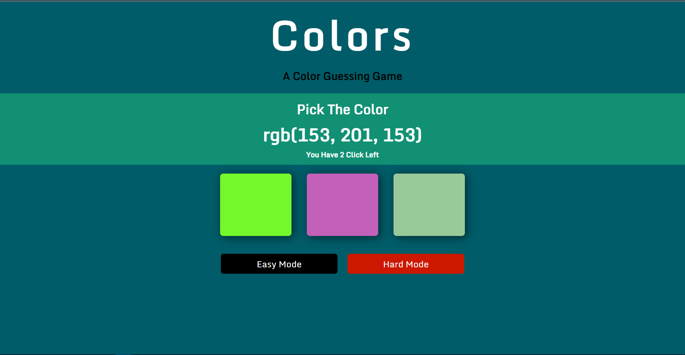
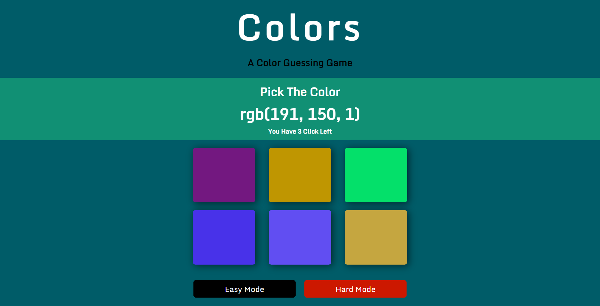

## About The Project
# Colors
Colour guessing game based on javascript and DOM

### How to Play
- You will be given a RGB value of a color 
- You will be given some card of some random colour depending upon the diffuculty level
- From the given card you have choose and click on the correct coloured card corrosponding the given RGB value
- You will be given some chances to choose the right colour based on the difficulty level

### Built With

- HTML5
- CSS3
- JavaScript

### Features
- Two difficulty levels - Easy and Medium
- Interactive dynamic texts

### Easy Mode

### Hard Mode

